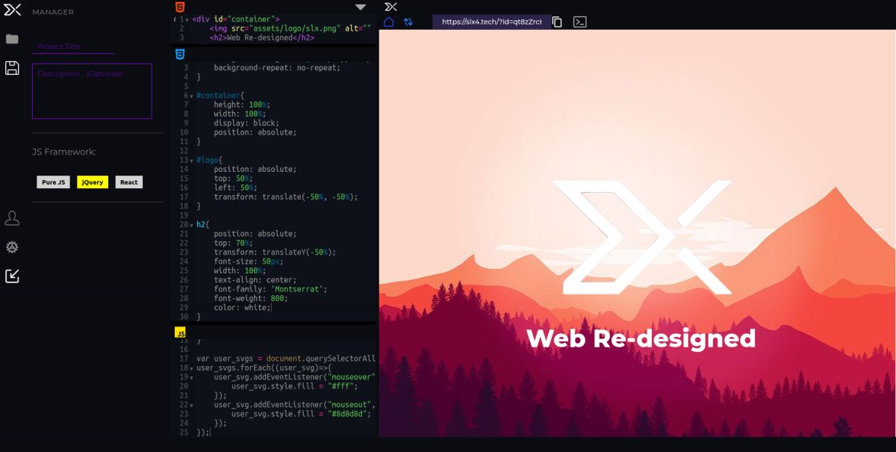

# Storm - Powered by ScribbleX

Storm is an open-source real-time web editor. Storm allows users to create, test, and debug JavaScript code in a secured environment with Live Preview.
We decided to keep it in Pure JS since, the level of customization provided by pure JS is unmatchable and also, anyone can understand it.

Most of the functionalities have their own JS files to avoid any sort of clatter.

## Installation

Download the source code of the project from the github repository and install it in a directory of WAMP / LAMP / XAMPP server.
That's how easy it is.

## License

[MIT](https://choosealicense.com/licenses/mit/)

## Support

For support, email info@scribblex.net we will be happy to help.

## Demo

https://storm.scribblex.net

## Feedback

If you have any feedback, please reach out to us at dev@scribblex.net

